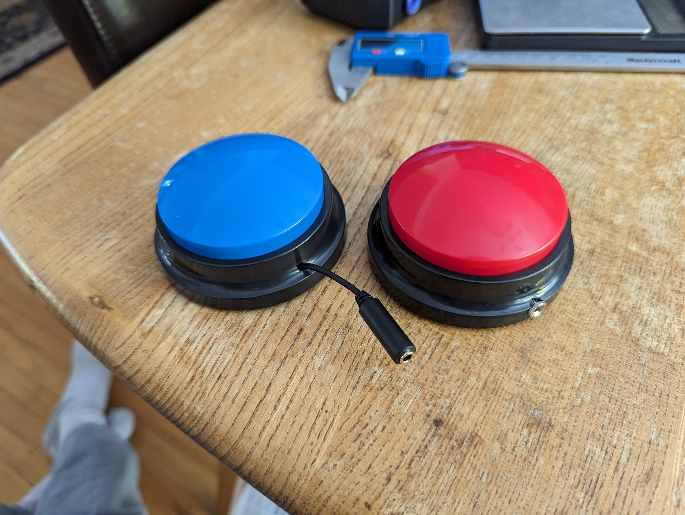

# Single Message Playback Switch
The Single Message Playback Switch is a switch adapted device that can store and play back a single 30 second message. The device can be used both as a toy or as a communication aid. A commercially available voice recording button is modified so that it can be activated using a secondary assistive switch with a 3.5 mm plug. 

To setup the device, a carer or helper needs to press the record button and require the desired message or sound. An assistive switch is then connected to the 3.5 mm jack.  To use the device, activate the assistive switch. When the assistive switch is activated, the pre-recorded message or sound will be played through the speaker. The device can also be activated direcly by pressing the integrated button on the top.

## More info at
- [Makers Making Change Device Library Listing]([https://makersmakingchange.com/project/Single-Message-Playback-Switch/](https://www.makersmakingchange.com/s/product/single-message-playback-switch/01tJR000001HyonYAC))

## How to Obtain a Single Message Playback Switch
### 1. Do it Yourself (DIY) or Do it Together (DIT)

This is an open-source assistive technology, so anyone is free to build it. All of the files and instructions required to build the Single Message Playback Switch are contained within this repository. Refer to the Maker Checklist below.

### 2. Request a build of this device

If you would like to obtain a Single Message Playback Switch, you may submit a build request through the [MMC Library Page](https://www.makersmakingchange.com/s/product/single-message-playback-switch/01tJR000001HyonYAC). The requestor is responsible for the cost of materials and any shipping.

### 3. How to build this device for someone else

If you have the skills and equipment to build this device, and would like to donate your time to create the switch for someone who needs it, visit the [MMC Maker Wanted](https://makersmakingchange.com/maker-wanted/) section.

## Getting Started

### 1. Read the Makers Checklist

The [Maker Checklist(/Documentation/Single_Message_Playback_Switch_Maker_Checklist.pdf) outlines the steps required to build the device.

### 2. Order the Off-The-Shelf Components

The [Bill of Materials](/Documentation/Single_Message_Playback_Switch_BOM.xlsx) lists all of the parts and components required to build the Single Message Playback Switch. 

### 3. Assemble the Single Message Playback Switch

Reference the [Assembly Guide](/Documentation/Single_Message_Playback_Switch_Maker_Guide.pdf) for the tools and steps required to build each portion.

## Files
### Documentation
| Document             | Version | Link |
|----------------------|---------|------|
| Maker's Checklist    | 1.0     | [Single_Message_PLayback_Switch_Maker_Checklist](/Documentation/Single_Message_Playback_Switch_Maker_Checklist.pdf)  | 
| Bill of Materials    | 1.0     | [Single_Message_Playback_Switch_Bill_of_Materials](/Documentation/Single_Message_Playback_Switch_BOM.xlsx)     |
| 3D Printing Guide    | 1.0     | [Single_Message_Playback_Switch_3D_Printing_Guide](/Documentation/Single_Message_Playback_Switch_3D_Printing_Guide.pdf)     |
| Maker Guide       | 1.0     | [Single_Message_Playback_Switch_Assembly_Guide](/Documentation/Single_Message_Playback_Switch_Assembly_Guide.pdf)     |
| User Guide           | 1.0     | [Single_Message_Playback_Switch_User_Guide](/Documentation/Single_Message_Playback_Switch_User_Guide.pdf)    |
| Design Rationale     | 1.0     | [Single_Message_Playback_Switch_Design_Rationale](/Documentation/Single_Message_Playback_Switch_Design_Rationale.pdf)     |
| Changelog            | 1.0     | [Single_Message_Playback_Switch_Changelog](Changes.txt)     |

<!---
### Design Files
[CAD Files](/Design_Files)
--->
<!---
### Build Files
 - [3D Printing Files](/Build_Files/3D_Printing_Files)
 --->

## Attribution
Documentation and Design by Neil Squire Society/Makers Making Change

Contributors:
 - Brad Wellington, Neil Squire Society / Makers Making Change
 - Jake McIvor, Neil Squire Society / Makers Making Change

## License
Everything needed or used to design, make, test, or prepare the Single Message Playback Switch is licensed under the [Attribution-NonCommercial-ShareAlike 4.0 ](https://creativecommons.org/licenses/by-nc-sa/4.0/).

Accompanying material such as instruction manuals, videos, and other copyrightable works that are useful but not necessary to design, make, test, or prepare the Single Message Playback Switch are published under a Creative Commons Attribution-ShareAlike 4.0 license https://creativecommons.org/licenses/by-sa/4.0/ (CC BY-SA 4.0).

---

## About Makers Making Change

Makers Making Change is a program of [Neil Squire](https://www.neilsquire.ca/), a Canadian non-profit that uses technology, knowledge, and passion to empower people with disabilities.

Makers Making Change leverages the capacity of community based Makers, Disability Professionals and Volunteers to develop and deliver affordable Open Source Assistive Technologies.

 - Website: [www.MakersMakingChange.com](https://www.makersmakingchange.com/)
 - GitHub: [makersmakingchange](https://github.com/makersmakingchange)
 - X (formally Twitter): [@makermakechange](https://twitter.com/makermakechange)
 - Instagram: [@makersmakingchange](https://www.instagram.com/makersmakingchange)
 - Facebook: [makersmakechange](https://www.facebook.com/makersmakechange)
 - LinkedIn: [Neil Squire Society](https://www.linkedin.com/company/neil-squire-society/)
 - Thingiverse: [makersmakingchange](https://www.thingiverse.com/makersmakingchange/about)
 - Printables: [MakersMakingChange](https://www.printables.com/@MakersMakingChange)

### Contact Us
For technical questions, to get involved, or to share your experience we encourage you to [visit our website](https://www.makersmakingchange.com/) or [contact us](https://www.makersmakingchange.com/s/contact).

## Contact Us

For technical questions, to get involved, or share your experience we encourage you to visit the [MMC Website](https://www.makersmakingchange.com/), [MMC Forum](https://makersmakingchange.com/forum), or contact info@makersmakingchange.com
